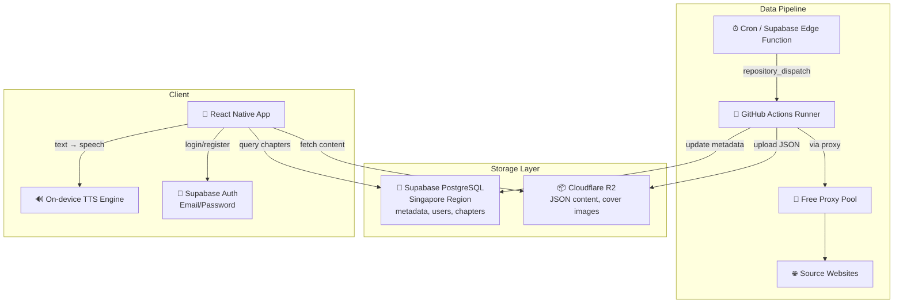
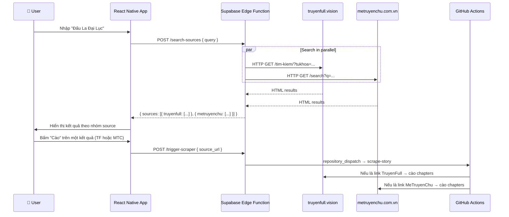

# Reader Hub — Project Context & Documentation

Hệ thống đọc truyện audio theo mô hình **Server-side Scraping (GitHub Actions)** + **On-device TTS (Google TTS)**.

---

## 1. Architecture (Kiến trúc)



---

## 2. Decisions (Quyết định thiết kế)

| Câu hỏi | Quyết định |
|----------|------------|
| **Proxy** | Không dùng dịch vụ trả phí. Sử dụng `proxy_rotator.py` cào proxy miễn phí, test song song, xoay vòng khi bị block |
| **Target Websites** | `truyenfull.vision` + `metruyenchu.com.vn`. Domain cấu hình tại `scraper/sites_config.py` — đổi domain chỉ cần sửa 1 file |
| **Supabase Region** | **Singapore** ✅ |
| **Auth Flow** | **Có đăng nhập** — Email/Password qua Supabase Auth. Có nút "Bỏ qua" |
| **Search Flow** | Tìm kiếm trên app → gọi Edge Function → search song song nhiều trang → user chọn web để cào |
| **Pagination** | Tự động nhận diện tổng số trang mục lục. Scraper tự động lặp (loop) qua các trang cho đến khi tìm thấy đủ chương yêu cầu |

---

## 2.1. Multi-Source Search Flow (Luồng tìm & cào)



---

## 3. Project Structure (Cấu trúc dự án)

```text
reader-hub/
├── .github/workflows/
│   └── scraper.yml             # GitHub Actions: cron + dispatch + manual
├── mobile/                     # React Native Expo App
│   ├── app/
│   │   ├── _layout.tsx         # Root layout (auth listener)
│   │   ├── auth.tsx            # Login / Register screen
│   │   ├── (tabs)/             # Tab screens: Home, Search, Library
│   │   ├── reader/             # Reader screen + TTS controls
│   │   └── story/              # Story detail & chapter list
│   ├── components/
│   │   └── StoryCard.tsx       # Reusable card (grid + horizontal)
│   ├── lib/
│   │   ├── supabase.ts         # DB client + query helpers
│   │   ├── r2.ts               # Content fetcher + LRU cache
│   │   ├── tts.ts              # TTS engine wrapper
│   │   └── theme.ts            # Design system tokens
│   └── app.json                # Expo config
├── scraper/                    # Python Scraping Engine
│   ├── parsers.py              # Plugin parser system (TruyenFull, MeTruyenChu)
│   ├── sites_config.py         # Centralized domain and site URL configurations
│   ├── search_sources.py       # Parallel story searcher across target sites
│   ├── proxy_rotator.py        # Free proxy scraper + pool + rotation
│   ├── r2_uploader.py          # Cloudflare R2 upload (S3-compatible)
│   ├── scraper.py              # Main orchestrator
│   ├── test_local.py           # CLI runner & diagnostics for local parsing tests
│   ├── supabase_client.py      # DB interaction
│   └── requirements.txt        # Python deps
├── supabase/
│   ├── functions/              # Edge Functions
│   │   └── trigger-scraper/    # Webhook → GitHub Actions
│   └── migrations/
│       └── 001_initial_schema.sql  # 6 tables + RLS + triggers
├── .env.example
├── .gitignore
└── CONTEXT.md                  # ← This file
```

---

## 4. Database Schema (6 tables)

| Table | Mô tả |
|-------|--------|
| `profiles` | User profiles (extends auth.users, auto-created on signup) |
| `stories` | Story metadata: title, slug, author, genres, cover, status |
| `chapters` | Chapter metadata + R2 URL cho nội dung |
| `reading_history` | Lịch sử đọc per user (chapter + scroll position) |
| `bookmarks` | Truyện yêu thích |
| `scrape_jobs` | Theo dõi trạng thái các lần cào |

---

## 5. Parser Plugin System

Để thêm website mới, tạo class kế thừa `BaseSiteParser` trong `scraper/parsers.py`:

```python
class NewSiteParser(BaseSiteParser):
    name = "newsite"

    def get_chapter_list_url(self, story_url, page=1): ...
    def parse_story_info(self, html, url): ...
    def parse_chapter_list(self, html): ...
    def parse_chapter_content(self, html): ...
    def parse_max_pages(self, html): ...

# Register in PARSERS dict and update detect_parser()
```

Hiện đã implement: `TruyenFullParser` và `MeTruyenChuParser`.

---

## 6. Free Proxy System

Flow hoạt động:
1. **Fetch**: Cào danh sách proxy từ 4+ nguồn GitHub public
2. **Test**: Test song song (20 concurrent) qua `httpbin.org/ip`
3. **Pool**: Giữ ~20 proxy hoạt động tốt
4. **Rotate**: Khi bị 403/timeout → đổi proxy → retry
5. **Evict**: Proxy fail ≥3 lần → loại khỏi pool

---

## 7. Setup Instructions

### A. Supabase
1. Tạo project tại supabase.com (Region: **Singapore**)
2. Chạy SQL trong `supabase/migrations/001_initial_schema.sql`
3. Bật Auth → Email provider
4. Lưu URL + Anon Key + Service Role Key

### B. Cloudflare R2
1. Tạo bucket `reader-hub-data`
2. Enable public domain hoặc R2.dev subdomain
3. Tạo API Token (Edit permission)

### C. GitHub Actions
1. Push code lên GitHub
2. Thêm Secrets: `CF_ACCOUNT_ID`, `R2_ACCESS_KEY_ID`, `R2_SECRET_ACCESS_KEY`, `R2_BUCKET_NAME`, `R2_PUBLIC_DOMAIN`, `SUPABASE_URL`, `SUPABASE_SERVICE_KEY`
3. `PROXY_URL` không bắt buộc (dùng free proxy tự động)
4. Test bằng `workflow_dispatch` trên Actions tab hoặc chạy `test_local.py` để kiểm tra parse offline

### D. Mobile App
1. `cd mobile && npm install`
2. Tạo `.env` với `EXPO_PUBLIC_SUPABASE_URL` và `EXPO_PUBLIC_SUPABASE_ANON_KEY`
3. Dev build: `eas build --profile development --platform android`
4. Cài `react-native-tts` (yêu cầu dev build)
