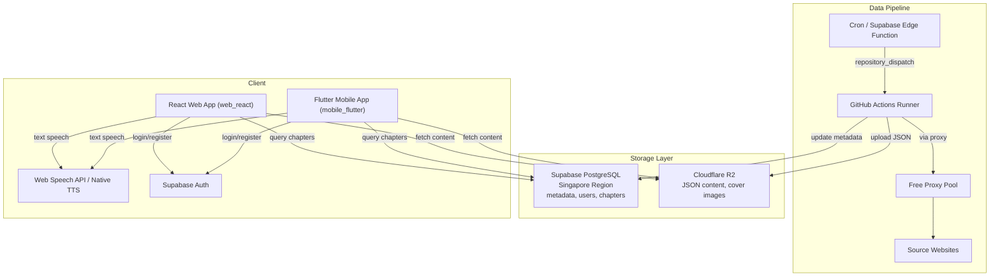
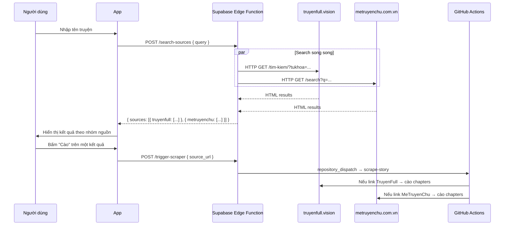

# Reader Hub

Hệ thống đọc truyện audio (văn học mạng) theo mô hình **Server-side Scraping (GitHub Actions)** + **On-device TTS (Text-to-Speech)**. Miễn phí 100%, triển khai hoàn toàn trên Cloud.

## Kiến trúc



## Tính năng

- **Cào truyện tự động**: Tự động lấy nội dung từ TruyenFull, MeTruyenChu, TruyenDich qua GitHub Actions
- **Đọc truyện bằng giọng nói**: TTS trực tiếp trên thiết bị, không cần tải file audio
- **Đa nền tảng**: Web (React) + Mobile (Flutter — Android, iOS, Windows, Linux, macOS)
- **Proxy miễn phí**: Tự động thu thập và xoay vòng proxy từ nhiều nguồn công cộng
- **Cloud-native**: Supabase (PostgreSQL + Auth) + Cloudflare R2 (storage)
- **Tìm kiếm đa nguồng**: Gửi một truy vấn, tìm kiếm đồng thời trên nhiều website
- **Kiến trúc plugin**: Dễ dàng thêm nguồn truyện mới mà không sửa logic lõi

## Luồng tìm kiếm đa nguồng



## Cấu trúc dự án

```
reader-hub/
├── web_react/                  # React Web App (Capacitor hybrid)
│   ├── src/
│   │   ├── app/screens/        # Auth, Home, Detail, Reader, Scrape screens
│   │   ├── lib/                # Supabase, R2, TTS service clients
│   │   └── main.tsx            # Entry point
│   └── package.json
├── mobile_flutter/             # Flutter Mobile App
│   ├── lib/                    # Dart source code
│   └── pubspec.yaml
├── scraper/                    # Python Scraping Engine (Playwright)
│   ├── parsers.py              # Parser plugins: TruyenFull, MeTruyenChu, TruyenDich
│   ├── sites_config.py         # Domain configuration
│   ├── proxy_rotator.py        # Free proxy pool
│   ├── r2_uploader.py          # R2/S3 storage client
│   ├── scraper.py              # Orchestrator
│   └── search_sources.py       # Multi-source search
├── scrapling/                  # Python Scraping Engine (Scrapling, experimental)
│   ├── parsers.py
│   ├── sites_config.py
│   ├── proxy_rotator.py
│   ├── scraper.py
│   └── search_sources.py
├── supabase/
│   ├── functions/              # Edge Functions
│   │   ├── search-sources/     # POST /search-sources
│   │   └── trigger-scraper/    # POST /trigger-scraper
│   └── migrations/             # DB Schema
├── .github/workflows/
│   └── scraper.yml             # GitHub Actions pipeline
├── CONTEXT.md                  # Project state & decision log
└── AGENTS.md                   # AI coding conventions
```

## Cơ sở dữ liệu

| Table | Mô tả |
|-------|-------|
| `profiles` | User profiles (extends auth.users) |
| `stories` | Story metadata: title, author, genres, cover, status |
| `chapters` | Chapter metadata + R2 content URL |
| `reading_history` | Reading progress per user (chapter + scroll position) |
| `bookmarks` | Favorite stories |
| `scrape_jobs` | Scraping job tracking & status |

## Tech stack

| Component | Công nghệ |
|-----------|-----------|
| **Web App** | React 18 + Vite + TypeScript + MUI 7 + Tailwind CSS 4 + Radix UI |
| **Mobile App** | Flutter 3.x + Dart |
| **Scraping Engine** | Python + Playwright / Scrapling + BeautifulSoup + lxml |
| **Database** | Supabase PostgreSQL (Singapore) |
| **Object Storage** | Cloudflare R2 (JSON content, cover images) |
| **Authentication** | Supabase Auth (Email/Password) |
| **Text-to-Speech** | Web Speech API / flutter_tts / @capacitor-community/text-to-speech |
| **CI/CD** | GitHub Actions (cron + repository_dispatch) |
| **Proxy** | Free proxy pool (4+ nguồn GitHub public) |

## Triết lý thiết kế

1. **Miễn phí 100%**: Chỉ dùng dịch vụ Cloud có Free Tier (Supabase, Cloudflare R2, GitHub Actions)
2. **Triển khai Cloud hoàn toàn**: Toàn bộ hệ thống vận hành trên Cloud, không phụ thuộc máy cá nhân
3. **Bền vững**: Domain nguồn dễ thay đổi, thiết kế để cập nhật cấu hình nhanh chỉnh sửa 1 file

## Hướng dẫn cài đặt

### Yêu cầu

- Node.js 18+ / pnpm
- Flutter SDK 3.x
- Python 3.12+
- Tài khoản Supabase
- Tài khoản Cloudflare R2

### 1. Supabase

1. Tạo project tại [supabase.com](https://supabase.com) (Region: **Singapore**)
2. Chạy migration: `supabase/migrations/001_initial_schema.sql`
3. Bật Auth → Email provider
4. Lưu URL, Anon Key, Service Role Key

### 2. Cloudflare R2

1. Tạo bucket `reader-hub-data`
2. Bật public access (R2.dev subdomain)
3. Tạo API Token với quyền Edit

### 3. GitHub Secrets

| Secret | Mô tả |
|--------|-------|
| `CF_ACCOUNT_ID` | Cloudflare Account ID |
| `R2_ACCESS_KEY_ID` | R2 Access Key |
| `R2_SECRET_ACCESS_KEY` | R2 Secret Access Key |
| `R2_BUCKET_NAME` | Bucket name |
| `R2_PUBLIC_DOMAIN` | R2 public domain |
| `SUPABASE_URL` | Supabase project URL |
| `SUPABASE_SERVICE_KEY` | Supabase service role key |

### 4. Web App (React)

```bash
cd web_react
pnpm install
cp .env.example .env   # Điền credentials
pnpm dev               # http://localhost:5173
pnpm build             # Production build → dist/
```

### 5. Mobile App (Flutter)

```bash
cd mobile_flutter
flutter pub get
flutter run
```

### 6. Scraper (chạy thử local)

```bash
cd scraper
pip install -r requirements.txt
playwright install chromium
python test_local.py
```

## Hệ thống plugin Parser

Thêm website nguồn mới bằng cách tạo class kế thừa `BaseSiteParser` trong `scraper/parsers.py`:

```python
class NewSiteParser(BaseSiteParser):
    name = "newsite"

    def get_chapter_list_url(self, story_url, page=1): ...
    def parse_story_info(self, html, url): ...
    def parse_chapter_list(self, html): ...
    def parse_chapter_content(self, html): ...
    def parse_max_pages(self, html): ...
```

Đăng ký site config trong `sites_config.py`. Khi domain thay đổi, chỉ cần sửa URL ở 1 file.
