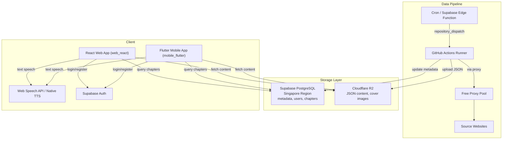

# Reader Hub

Hệ thống đọc truyện audio (văn học mạng) theo mô hình **Server-side Scraping (GitHub Actions)** + **On-device TTS (Text-to-Speech)**. Miễn phí 100%, triển khai hoàn toàn trên Cloud.

## Kiến trúc tổng quan



## Tính năng chính

- **Scraping tự động**: Crawl nội dung truyện từ nhiều nguồn (TruyenFull, MeTruyenChu, TruyenDich) qua GitHub Actions
- **Text-to-Speech**: Đọc truyện bằng giọng nói trực tiếp trên thiết bị (Web Speech API / Flutter TTS)
- **Multi-platform**: Web app (React) và Mobile app (Flutter)
- **Free Proxy Pool**: Tự động thu thập và xoay vòng proxy miễn phí để tránh bị chặn
- **Cloud-native**: Supabase (PostgreSQL + Auth) + Cloudflare R2 (storage)
- **Multi-source Search**: Tìm kiếm truyện trên nhiều nguồn cùng lúc

## Cấu trúc dự án

```
reader-hub/
├── web_react/                  # React Web App (Capacitor)
│   ├── src/
│   │   ├── app/screens/        # Auth, Home, Detail, Reader, Scrape
│   │   ├── lib/                # Supabase, R2, TTS services
│   │   └── main.tsx            # Entry point
│   └── package.json
├── mobile_flutter/             # Flutter Mobile App
│   ├── lib/                    # Dart source code
│   └── pubspec.yaml
├── scraper/                    # Python Scraping Engine (Playwright)
│   ├── parsers.py              # Parser plugins: TruyenFull, MeTruyenChu, TruyenDich
│   ├── sites_config.py         # Domain configurations
│   ├── proxy_rotator.py        # Free proxy pool system
│   ├── r2_uploader.py          # R2/S3 storage logic
│   ├── scraper.py              # Main orchestrator
│   └── search_sources.py       # Multi-source search
├── scrapling/                  # Python Scraping Engine (Scrapling - experimental)
│   ├── parsers.py              # Parser plugins (same sites)
│   ├── sites_config.py
│   ├── proxy_rotator.py
│   ├── scraper.py
│   └── search_sources.py
├── supabase/
│   ├── functions/              # Edge Functions
│   │   ├── search-sources/     # POST /search-sources
│   │   └── trigger-scraper/    # POST /trigger-scraper
│   └── migrations/             # Database schema
├── .github/workflows/
│   └── scraper.yml             # GitHub Actions workflow
├── CONTEXT.md                  # Project state documentation
└── AGENTS.md                   # AI coding guidelines
```

## Database schema

| Table | Mô tả |
|-------|-------|
| profiles | User profiles (extends auth.users) |
| stories | Story metadata: title, author, genres, cover, status |
| chapters | Chapter metadata + R2 URL cho nội dung |
| reading_history | Reading history per user (chapter + scroll position) |
| bookmarks | Favorite stories |
| scrape_jobs | Scraping job tracking |

## Tech stack

| Component | Công nghệ |
|-----------|-----------|
| **Web App** | React 18 + Vite + TypeScript + MUI + Tailwind CSS + Radix UI |
| **Mobile App** | Flutter + Dart |
| **Scraping Engine** | Python + Playwright / Scrapling + BeautifulSoup |
| **Database** | Supabase PostgreSQL (Singapore) |
| **Storage** | Cloudflare R2 (JSON content, cover images) |
| **Auth** | Supabase Auth (Email/Password) |
| **TTS** | Web Speech API / flutter_tts / @capacitor-community/text-to-speech |
| **CI/CD** | GitHub Actions (cron + repository_dispatch) |
| **Proxy** | Free proxy pool (tự thu thập từ nhiều nguồn) |

## Setup

### 1. Supabase

- Tạo project tại supabase.com (Region: **Singapore**)
- Chạy SQL migration: supabase/migrations/001_initial_schema.sql
- Bật Auth provider (Email)
- Lưu URL + Anon Key + Service Role Key

### 2. Cloudflare R2

- Tạo bucket reader-hub-data
- Enable public access (R2.dev subdomain)
- Tạo API Token (Edit permission)

### 3. GitHub Secrets

Thêm vào GitHub repository:

| Secret | Mô tả |
|--------|-------|
| CF_ACCOUNT_ID | Cloudflare Account ID |
| R2_ACCESS_KEY_ID | R2 Access Key |
| R2_SECRET_ACCESS_KEY | R2 Secret Access Key |
| R2_BUCKET_NAME | Bucket name |
| R2_PUBLIC_DOMAIN | R2 public domain |
| SUPABASE_URL | Supabase project URL |
| SUPABASE_SERVICE_KEY | Supabase service role key |

### 4. Web App (React)

```bash
cd web_react
pnpm install
cp .env.example .env  # Điền Supabase credentials
pnpm dev              # http://localhost:5173
pnpm build            # Production build → dist/
```

### 5. Mobile App (Flutter)

```bash
cd mobile_flutter
flutter pub get
flutter run
```

### 6. Scraper (local test)

```bash
cd scraper
pip install -r requirements.txt
playwright install chromium
python test_local.py
```

## Parser plugin system

Thêm website mới bằng cách tạo class kế thừa `BaseSiteParser` trong `scraper/parsers.py`:

```python
class NewSiteParser(BaseSiteParser):
    name = "newsite"

    def get_chapter_list_url(self, story_url, page=1): ...
    def parse_story_info(self, html, url): ...
    def parse_chapter_list(self, html): ...
    def parse_chapter_content(self, html): ...
    def parse_max_pages(self, html): ...
```

Đăng ký site config trong `sites_config.py`. Khi domain thay đổi, chỉ cần sửa URL ở 1 file.

## Triết lý thiết kế

1. **Miễn phí 100%**: Chỉ dùng dịch vụ Cloud có Free Tier (Supabase, Cloudflare R2, GitHub Actions)
2. **Triển khai Cloud hoàn toàn**: Toàn bộ hệ thống vận hành trên Cloud, không phụ thuộc máy cá nhân
3. **Bền vững**: Domain nguồn dễ thay đổi, thiết kế để cập nhật cấu hình nhanh chỉnh sửa 1 file
