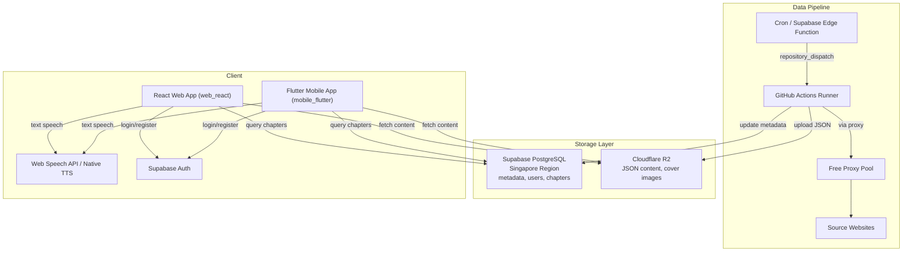
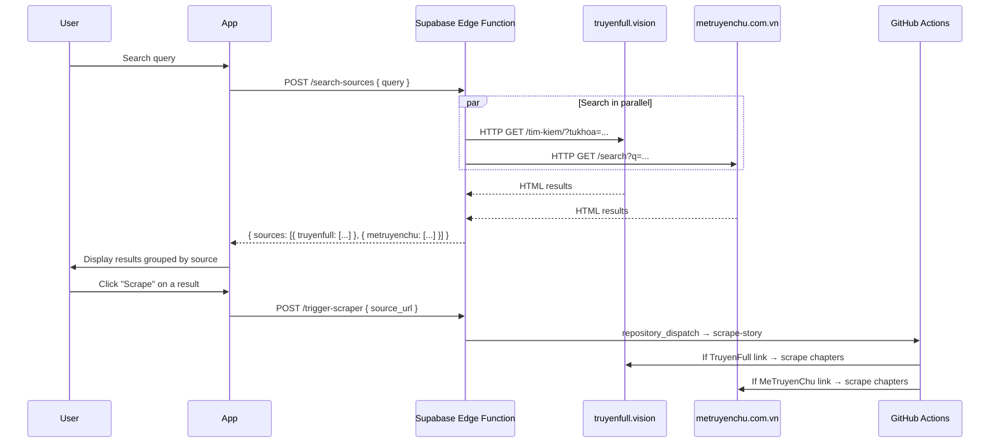

# Reader Hub

A cloud-native audiobook/story reading platform with **server-side scraping (GitHub Actions)** + **on-device TTS (Text-to-Speech)**. 100% free-tier infrastructure.

## Architecture



## Features

- **Automated scraping**: Crawl story content from multiple sources (TruyenFull, MeTruyenChu, TruyenDich) via GitHub Actions
- **Text-to-Speech**: On-device narration using Web Speech API / Flutter TTS
- **Multi-platform**: React web app + Flutter mobile app (Android, iOS, Windows, Linux, macOS)
- **Free proxy rotation**: Auto-collects and rotates free proxies to avoid IP blocking
- **Cloud-native stack**: Supabase (PostgreSQL + Auth) + Cloudflare R2 (object storage)
- **Multi-source search**: Simultaneous search across multiple story websites
- **Parser plugin system**: Extensible architecture for adding new content sources

## Multi-source search flow



## Project structure

```
reader-hub/
├── web_react/                  # React Web App (Capacitor hybrid)
│   ├── src/
│   │   ├── app/screens/        # Auth, Home, Detail, Reader, Scrape screens
│   │   ├── lib/                # Supabase, R2, TTS service clients
│   │   └── main.tsx            # Application entry point
│   └── package.json
├── mobile_flutter/             # Flutter Mobile App
│   ├── lib/                    # Dart source code
│   └── pubspec.yaml
├── scraper/                    # Python Scraping Engine (Playwright)
│   ├── parsers.py              # Parser plugins: TruyenFull, MeTruyenChu, TruyenDich
│   ├── sites_config.py         # Centralized domain configuration
│   ├── proxy_rotator.py        # Free proxy pool management
│   ├── r2_uploader.py          # R2/S3 storage client
│   ├── scraper.py              # Orchestrator
│   └── search_sources.py       # Multi-source search
├── scrapling/                  # Python Scraping Engine (Scrapling-based, experimental)
│   ├── parsers.py
│   ├── sites_config.py
│   ├── proxy_rotator.py
│   ├── scraper.py
│   └── search_sources.py
├── supabase/
│   ├── functions/              # Edge Functions
│   │   ├── search-sources/     # POST /search-sources
│   │   └── trigger-scraper/    # POST /trigger-scraper
│   └── migrations/             # Database schema migrations
├── .github/workflows/
│   └── scraper.yml             # GitHub Actions CI/CD pipeline
├── CONTEXT.md                  # Full project state & decision log
└── AGENTS.md                   # AI coding conventions
```

## Database schema

| Table | Description |
|-------|-------------|
| `profiles` | User profiles (extends auth.users, auto-created on signup) |
| `stories` | Story metadata: title, slug, author, genres, cover, status |
| `chapters` | Chapter metadata + R2 content URL |
| `reading_history` | Reading progress per user (chapter + scroll position) |
| `bookmarks` | Favorite stories |
| `scrape_jobs` | Scraping job tracking & status |

## Tech stack

| Component | Technology |
|-----------|------------|
| **Web App** | React 18 + Vite + TypeScript + MUI 7 + Tailwind CSS 4 + Radix UI |
| **Mobile App** | Flutter 3.x + Dart |
| **Scraping Engine** | Python + Playwright / Scrapling + BeautifulSoup + lxml |
| **Database** | Supabase PostgreSQL (Singapore region) |
| **Object Storage** | Cloudflare R2 (JSON content, cover images) |
| **Authentication** | Supabase Auth (Email/Password) |
| **Text-to-Speech** | Web Speech API / flutter_tts / @capacitor-community/text-to-speech |
| **CI/CD** | GitHub Actions (cron schedule + repository_dispatch webhook) |
| **Proxy** | Free proxy pool (aggregated from 4+ public GitHub sources) |

## Design principles

1. **100% free**: Uses only free-tier cloud services (Supabase, Cloudflare R2, GitHub Actions). Rate limits must be sufficient for personal/small-group use.
2. **Cloud-native**: Entire system runs on cloud infrastructure. No dependency on personal machines except during initial development.
3. **Resilient**: Source domains change frequently. Architecture allows rapid config updates without touching core logic.

## Setup

### Prerequisites

- Node.js 18+ / pnpm (for web app)
- Flutter SDK 3.x (for mobile app)
- Python 3.12+ (for scraper)
- A Supabase account
- A Cloudflare R2 account

### 1. Supabase

1. Create a project at [supabase.com](https://supabase.com) (Region: **Singapore**)
2. Run the migration: `supabase/migrations/001_initial_schema.sql`
3. Enable Auth → Email provider
4. Copy your URL, Anon Key, and Service Role Key

### 2. Cloudflare R2

1. Create a bucket named `reader-hub-data`
2. Enable public access (R2.dev subdomain or custom domain)
3. Create an API token with Edit permission

### 3. GitHub repository secrets

| Secret | Description |
|--------|-------------|
| `CF_ACCOUNT_ID` | Cloudflare Account ID |
| `R2_ACCESS_KEY_ID` | R2 Access Key |
| `R2_SECRET_ACCESS_KEY` | R2 Secret Access Key |
| `R2_BUCKET_NAME` | Bucket name |
| `R2_PUBLIC_DOMAIN` | R2 public domain URL |
| `SUPABASE_URL` | Supabase project URL |
| `SUPABASE_SERVICE_KEY` | Supabase service role key |

### 4. Web app (React)

```bash
cd web_react
pnpm install
cp .env.example .env   # Fill in your credentials
pnpm dev               # http://localhost:5173
pnpm build             # Production build → dist/
```

### 5. Mobile app (Flutter)

```bash
cd mobile_flutter
flutter pub get
flutter run
```

### 6. Scraper (local testing)

```bash
cd scraper
pip install -r requirements.txt
playwright install chromium
python test_local.py
```

## Parser plugin system

To add a new source website, create a class that inherits from `BaseSiteParser` in `scraper/parsers.py`:

```python
class NewSiteParser(BaseSiteParser):
    name = "newsite"

    def get_chapter_list_url(self, story_url, page=1): ...
    def parse_story_info(self, html, url): ...
    def parse_chapter_list(self, html): ...
    def parse_chapter_content(self, html): ...
    def parse_max_pages(self, html): ...
```

Register the site config in `sites_config.py`. When a domain changes, you only edit one file.
